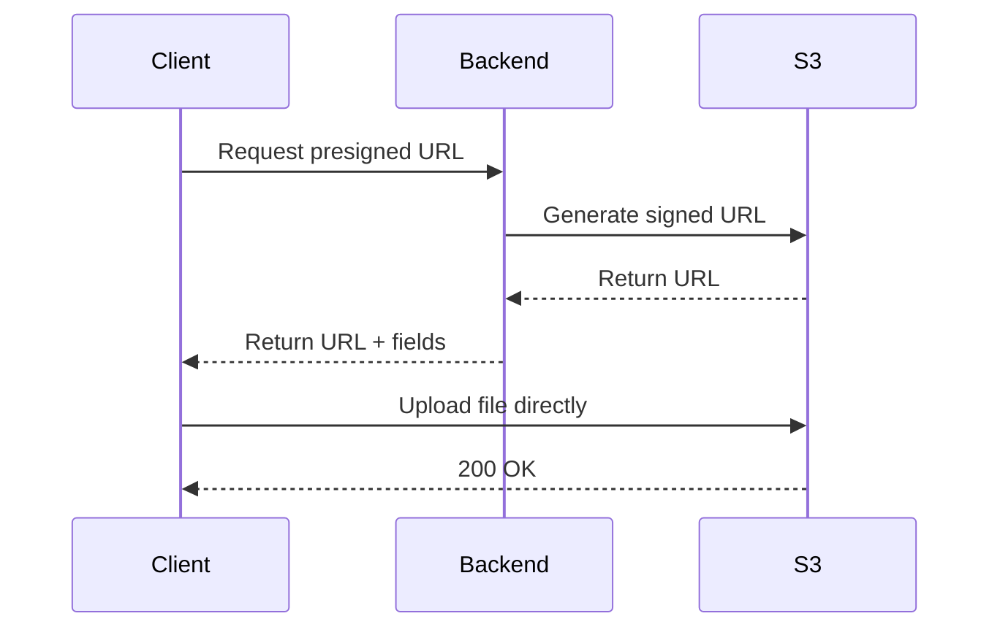
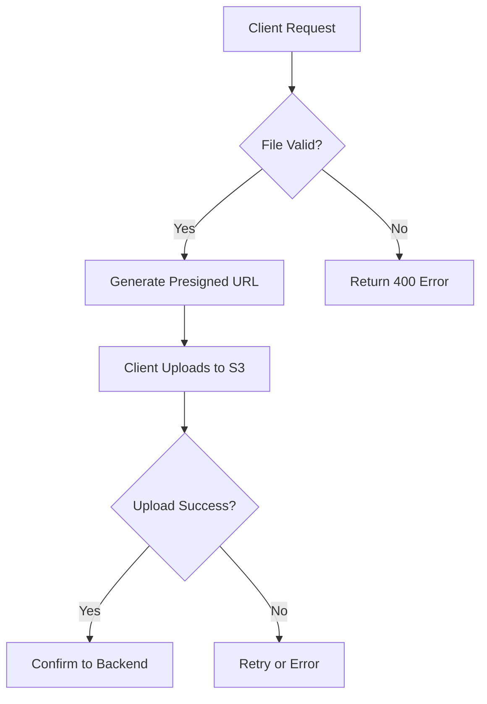
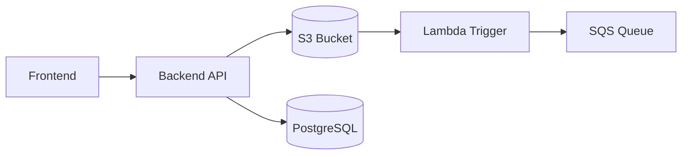

# Documentation Writing Skill

## Core Principles

Write like you're talking to a colleague. Be conversational, not formal. Get people what they need quickly. Know your audience and match the complexity.

## Output Location

All docs are saved in `docs/` folder with format: `FEATURE_NAME.md`

## When Writing Documentation

### Start Here

1. **Who is this for?** Match complexity to audience. Don't oversimplify hard things or overcomplicate simple ones.
2. **What do they need?** Get them to the answer fast. Nobody wants to be in docs longer than necessary.
3. **What did you struggle with?** Those common questions you had when learning? Answer them (without literally including the question).

### Writing Process

**Draft:**
- Write out the steps/explanation as you'd tell a colleague
- Lead with what to do, then explain why
- Use headings that state your point: "Configure S3 before uploading" not "S3 configuration"

**Edit:**
- Read aloud. Does it sound like you talking? If it's too formal, simplify.
- Cut anything that doesn't directly help the reader
- Check each paragraph has one clear purpose
- Verify examples actually work (don't give examples that error)

**Polish:**
- Make links descriptive (never "here" or "click here")
- Backticks only for code/variables, **bold** for UI elements
- Keep diagrams minimal and focused

## Tone and Voice

**Do:**
- Use contractions ("can't" not "cannot")
- Be friendly but not peppy
- Acknowledge limitations honestly

**Don't:**
- Use exclamation points excessively
- Use corporate jargon ("utilize", "offerings", "actionable insights")
- Describe tasks as "easy" or "simple" (you don't know the reader's context)
- Bury the action in explanation

## Structure and Clarity

**Lead with the important stuff:**
- Most important information first
- Lead with the ask, then provide context
- Cut text that adds little value (when in doubt, cut it)
- Each paragraph should have one clear purpose

**Make headings do the work:**
- Convey your actual point, not just the topic
- "Use presigned URLs for direct upload" ✅
- "Presigned URLs" ❌ (too vague)
- "How to use presigned URLs for direct upload" ❌ (too wordy)

## Document Structure Template

```markdown
# [Feature Name] - Documentation

## Mục lục
1. [Tổng quan](#tổng-quan)
2. [Khái niệm](#khái-niệm)
3. [Use Cases](#use-cases)
4. [Ví dụ Implementation](#ví-dụ-implementation)
5. [Tài liệu tham khảo](#tài-liệu-tham-khảo)

---

## Tổng quan

[Mô tả ngắn gọn - 2-3 câu]

[ASCII diagram hoặc Mermaid cho flow chính]

### Các thành phần chính

| Thành phần | Mô tả |
|------------|-------|
| ... | ... |

---

## Khái niệm

### [Khái niệm 1]

[Giải thích với diagram nếu cần]

### [Khái niệm 2]

[Bảng so sánh nếu có nhiều options]

| Tính năng | Option A | Option B |
|-----------|----------|----------|
| ... | ... | ... |

---

## Use Cases

### 1. [Use Case 1]
[Mô tả ngắn gọn scenario]

### 2. [Use Case 2]
[Mô tả ngắn gọn scenario]

---

## Ví dụ Implementation

### Backend (Spring Boot + Java)

```java
// Code example
```

### Frontend (TypeScript)

```typescript
// Code example
```

---

## Tài liệu tham khảo

| Chủ đề | Link |
|--------|------|
| **[Topic 1]** | https://... |
| **[Topic 2]** | https://... |

---

*Ngày tạo: [Date]*
*Project: realworld-exam*
```

## Diagrams

### Simple Flows: ASCII Art

Use ASCII art for simple, inline diagrams:

```
┌─────────────┐         ┌─────────────┐
│   Client    │────────►│   Server    │
└─────────────┘         └─────────────┘
```

Box characters: `┌ ┐ └ ┘ ─ │ ► ▼ ◄ ▲`

### Complex Logic: Mermaid Tool

For complex flows, use the `mermaid` tool to generate interactive diagrams with clickable code links.

**When to use Mermaid:**
- Multi-step workflows with branching logic
- System architecture with multiple components
- Sequence diagrams showing interactions between services
- State machines and decision trees
- Class/entity relationships

**Example - Sequence Diagram:**


**Example - Flowchart:**


**Example - Architecture:**


**Tips:**
- Include `citations` parameter to make nodes clickable, linking to code locations
- Use dark fill colors with light text for better visibility
- Keep diagrams focused - split complex systems into multiple diagrams

## Instructions Format

**Good:**
```markdown
Run:
```
command-to-run
```

Then:
```
next-command
```

This ensures you're getting the latest changes.
```

**Bad:** "(remember to run X before Y...)" buried in a paragraph.

## Formatting Quick Reference

| Write This | Not This |
|------------|----------|
| can't, don't | cannot, do not |
| **Save** button | `Save` button |
| Check out [the docs](link) | Click [here](link) |
| summarize | aggregate |
| people, companies | users |

## Code Examples

- Backend: Java with package `com.seft.learn.*`
- Frontend: TypeScript with strict mode
- Include necessary imports if important
- Verify examples actually work

## Red Flags to Avoid

- Multiple exclamation points
- Linking "here"
- Numbers that will change (guard against change)
- Describing things as "easy" or "simple"
- Code examples that don't work
- Burying action in explanation

## File Naming Convention

- Uppercase with underscore: `S3_PRESIGNED_URL.md`
- Prefix by category if related: `S3_CORS.md`, `S3_LIFECYCLE.md`
- Name by feature, not implementation

## References

See existing docs in `docs/` as examples:
- `docs/S3_PRESIGNED_URL.md` - Comprehensive example
- `docs/LARGE_DATA_EXPORT.md` - Backend-focused example
